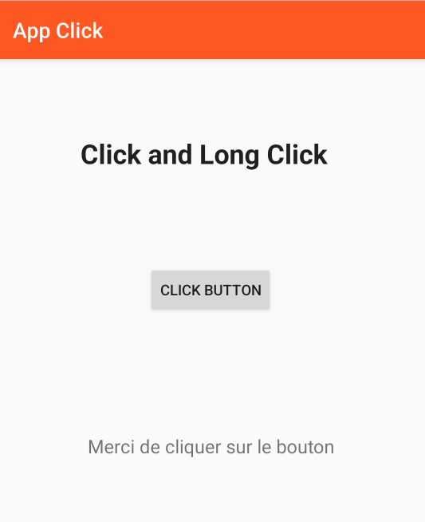
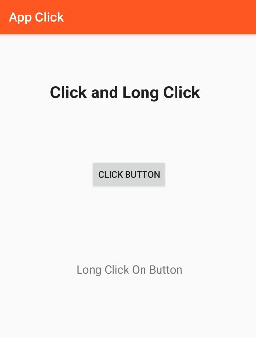

# Click et LongClick

## Description
Une application qui contient une activité (MainActivity) comprenant un bouton sur lequel seront appliqués les évènements de click suivants :
- OnClickListener
- OnLongClickListener
- 
## Screenshot

