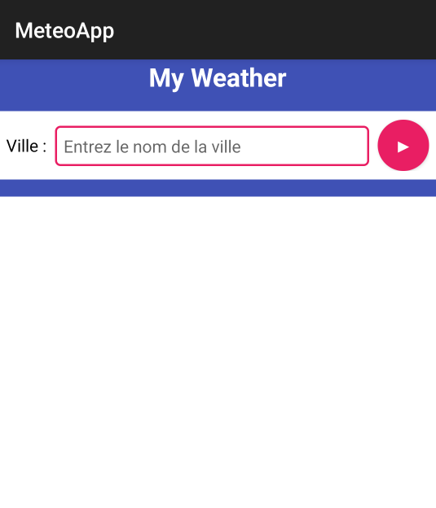
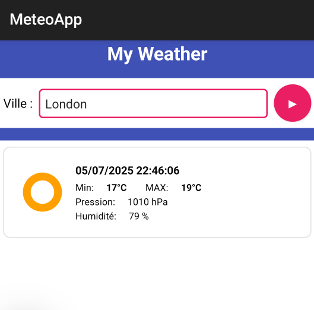

# Météo

## Description
Cette application mobile Android qui permet de :
• Saisir une ville 
• Afficher les prévisions météo de cette ville en faisant appel à l’API REST exposé par openweather.org. 
On affichera pour chaque prévision
    • Date et heure 
    • Température maximale 
    • Température minimale  
    • Pression atmosphérique 
    • Humidité

## Screenshot

