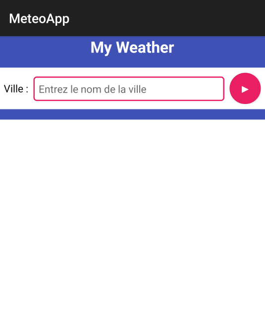

# Click et LongClick

## Description
Une application qui contient une activité (MainActivity) comprenant un bouton sur lequel seront appliqués les évènements de click suivants :
- OnClickListener
- OnLongClickListener
- 
## Screenshot

# Météo

## Description
Cette application mobile Android qui permet de :
• Saisir une ville 
• Afficher les prévisions météo de cette ville en faisant appel à l’API REST exposé par openweather.org. 
On affichera pour chaque prévision
    • Date et heure 
    • Température maximale 
    • Température minimale  
    • Pression atmosphérique 
    • Humidité

## Screenshot

